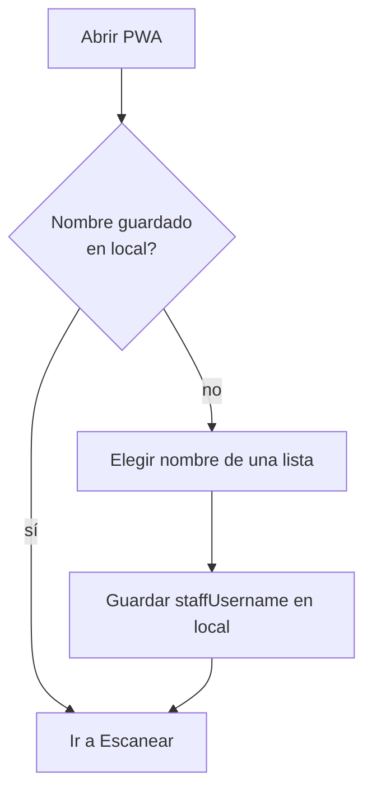
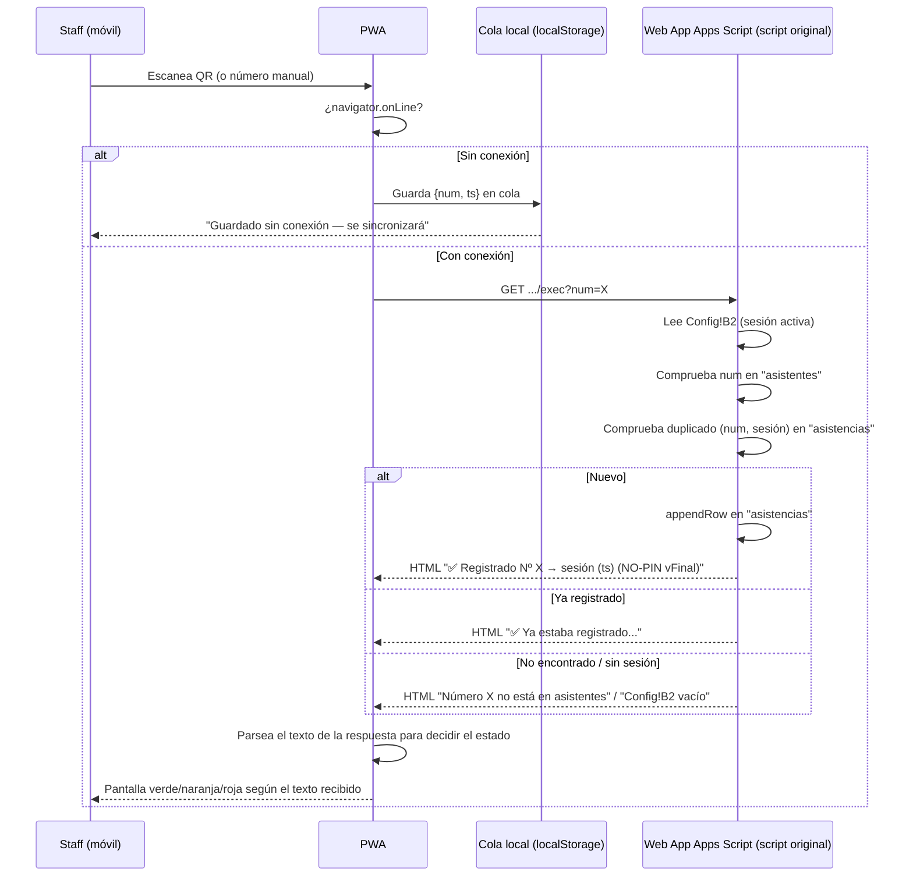
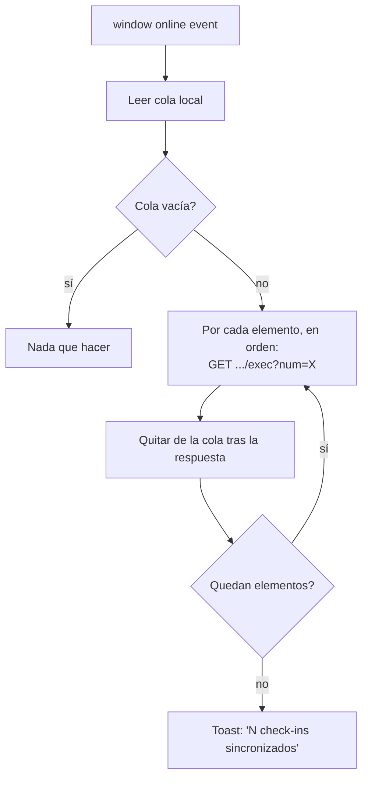
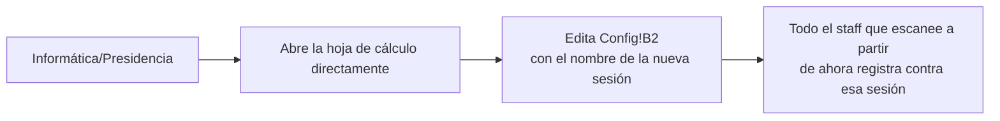

> ⚠️ Reescrito 2026-07-15 (pivote D13-D18, corregido en D21): flujos
> basados en Google Sheets + Apps Script, usando el script real de Pau
> **tal cual**, sin extensiones (ni LockService, ni columna `staff`, ni
> acción `stats`, ni JSON — ver D21).

# Flujos — Staff AJapp (PWA)

Diagramas en Mermaid. Base: `apps-script/Code.gs` (extensión del script
real `NO-PIN vFinal`) y `docs/SHEET_SCHEMA.md`.

## 1. Login (staff general)

Sin cambios de fondo respecto a lo decidido antes del pivote: sin
contraseña, se elige el nombre de una lista. Lo único que cambia es de
dónde sale esa lista — antes de una colección Firestore, ahora puede ser
tan simple como una lista fija en el propio código de la PWA (no hace
falta una llamada al Web App solo para esto, ~20 nombres no cambian cada
día). Si se prefiere que salga de la hoja, se puede añadir un
`action=staff` al Web App más adelante — no es necesario para el primer
lanzamiento.

## 2. Escanear / check-in (con offline)

**Sincronización al volver la conexión:**

**Duplicados entre dos móviles distintos sin red:** si ambos escanean al
mismo asistente offline, los dos lo aceptan localmente (no pueden verse
entre sí). Al sincronizar, el primero que llegue al Web App se registra;
el segundo recibe la respuesta "Ya estaba registrado" — el script
original no usa `LockService` (D21), así que en el caso límite de que dos
sincronizaciones lleguen exactamente a la vez existe una ventana de
carrera teórica. No se ha resuelto porque Pau pidió no tocar el script;
queda anotado por si en algún momento se decide lo contrario.

## 3. Estadísticas — pendiente de decidir la fuente de datos (D21)

El script original no tiene ninguna acción de lectura (el Atajo no tenía
pantalla de estadísticas). Sin tocarlo, la pantalla no tiene de dónde
sacar los números. Ver las 3 opciones en `docs/SHEET_SCHEMA.md`
("Pregunta abierta"). Hasta que Pau elija una, esta pantalla no tiene un
flujo de datos definido — no inventar uno.

## 4. Activar/cerrar sesión (fuera de la app — D15)

No hay ninguna pantalla ni login especial para esto en la app — es
exactamente como funcionaba con el Atajo de iPhone, solo que ahora varias
personas leen el mismo `Config!B2` en vez de una sola.

## 5. Inscripción / roster — fuera de alcance de este repo

La construcción de la lista `asistentes` (números + nombres) y cualquier
proceso de inscripción/registro con datos completos (DNI, menú, email...)
es un proceso aparte que Pau ya gestiona con el Excel/scripts de años
anteriores — **no es parte de lo que construye Claude Code en este repo**.
Si en el futuro se decide automatizar esa parte también, se documenta
aquí como una fase nueva.
