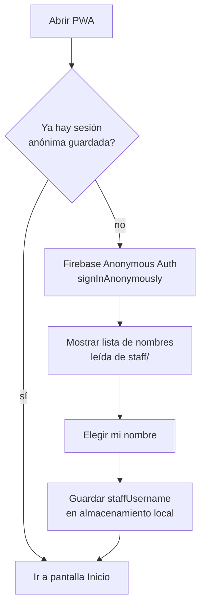
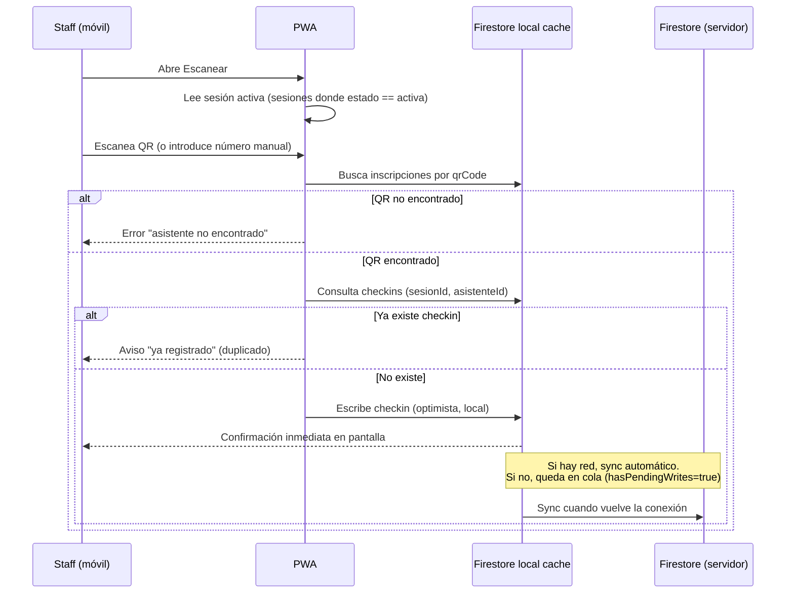
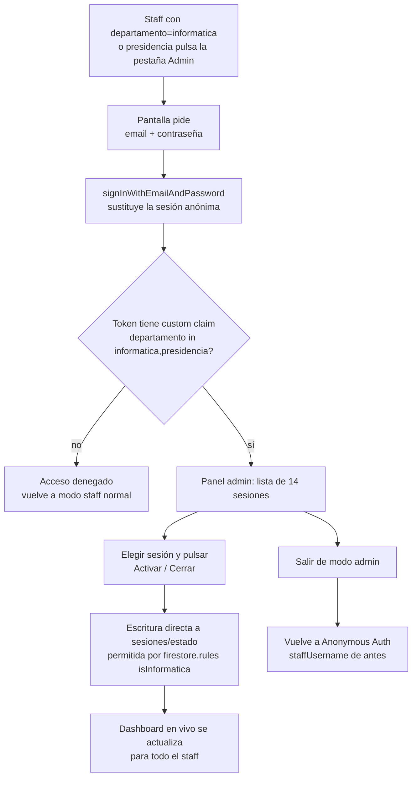
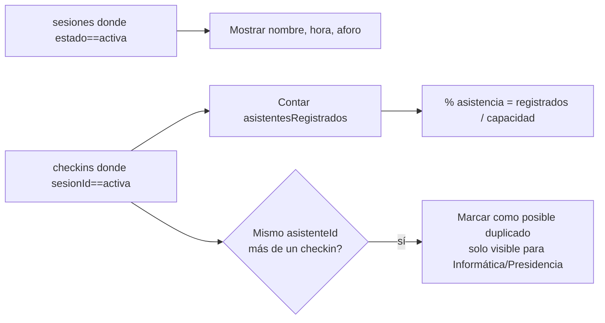
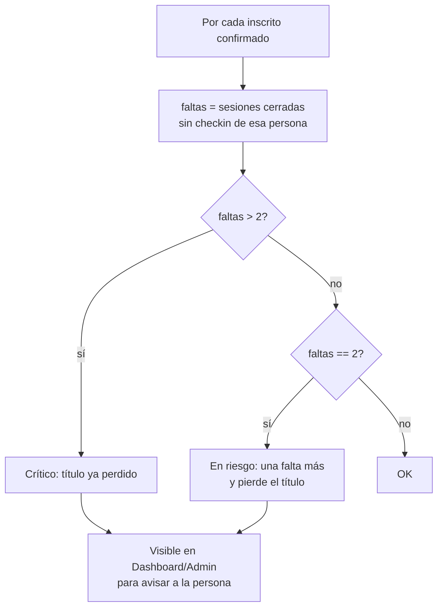
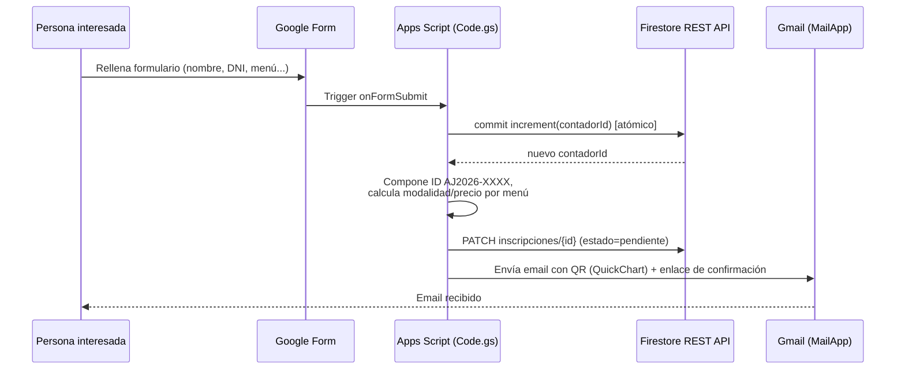
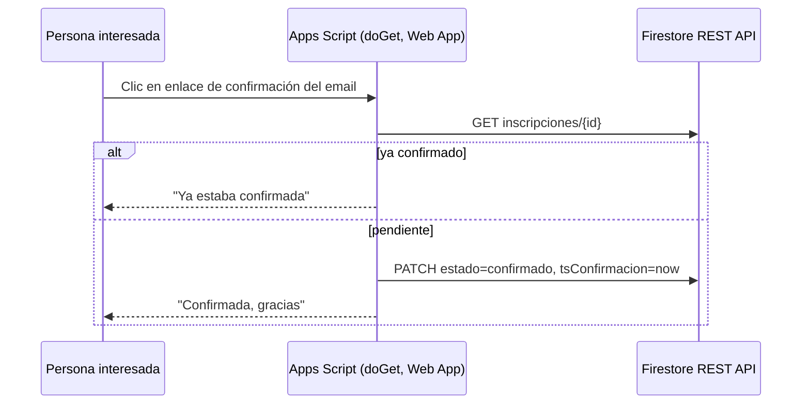
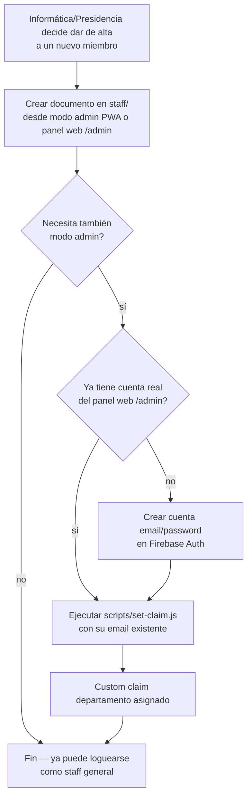

# Flujos — Staff AJapp (PWA)

Diagramas en Mermaid (se ven en GitHub, GitLab, VS Code y en Claude Code).
Basados en la lógica ya construida en Swift (`CheckinManager`,
`QRScannerManager`, `SessionManager`, `AttendeeManager` — carpeta antigua
`Staff AJapp/`, que queda como referencia funcional, no como código a
reutilizar) y en el prototipo Figma Make `dQjrZnwka2UzPESvIG5Gl3` (D9).

## 1. Login de staff (general)

No hay contraseña ni verificación de identidad — es atribución para saber
quién escaneó, no seguridad (ver `DECISIONS.md` D4). Cualquiera con el
enlace de la PWA podría, en teoría, elegir el nombre de otra persona; se
acepta porque es una herramienta interna de confianza entre ~20 compañeros.

## 2. Escaneo / check-in (con offline)

Registro manual (fallback si el QR no se puede leer): mismo flujo pero
introduciendo el ID `AJ2026-XXXX` a mano en vez de escanear.

**Duplicados offline:** si dos móviles hacen check-in de la misma persona
sin red antes de sincronizar, ambos lo aceptan (no pueden verse entre sí).
Al sincronizar, quedan dos documentos en `checkins` para el mismo
`(sesionId, asistenteId)`. El dashboard (flujo 4) los marca para revisión,
no se borran automáticamente.

## 3. Modo admin (Informática / Presidencia) — activar/cerrar sesión

En la demo actual (D10) esta pestaña se muestra solo si el nombre elegido
en el login tiene `departamento` informática/presidencia, sin más
verificación. El flujo de abajo es el cambio confirmado en D12: añade un
login real solo para estas ~4-5 personas, sin tocar el login del resto.

Solo puede haber una sesión `activa` a la vez (regla de negocio de la app,
no de Firestore — al activar una, la que estaba activa pasa a `cerrada`).

## 4. Dashboard (todos, en vivo)

**Riesgo de pérdida de título (D11, ya implementado en la demo como
`asistentesEnRiesgo`):** para cada inscrito confirmado, se cuentan las
faltas solo sobre sesiones ya `cerrada` y se compara con el máximo permitido
(`Math.floor(14 * (1 - porcentajeMinimo))` = 2 faltas):

## 5. Inscripción — Google Form → Firestore (D5)

## 6. Confirmación de inscripción

## 7. Alta de nuevo miembro de staff

`scripts/set-claim.js` se ejecuta localmente (Node + `firebase-admin`),
nunca desde la app ni desplegado — ver `PROJECT_SETUP.md`.
