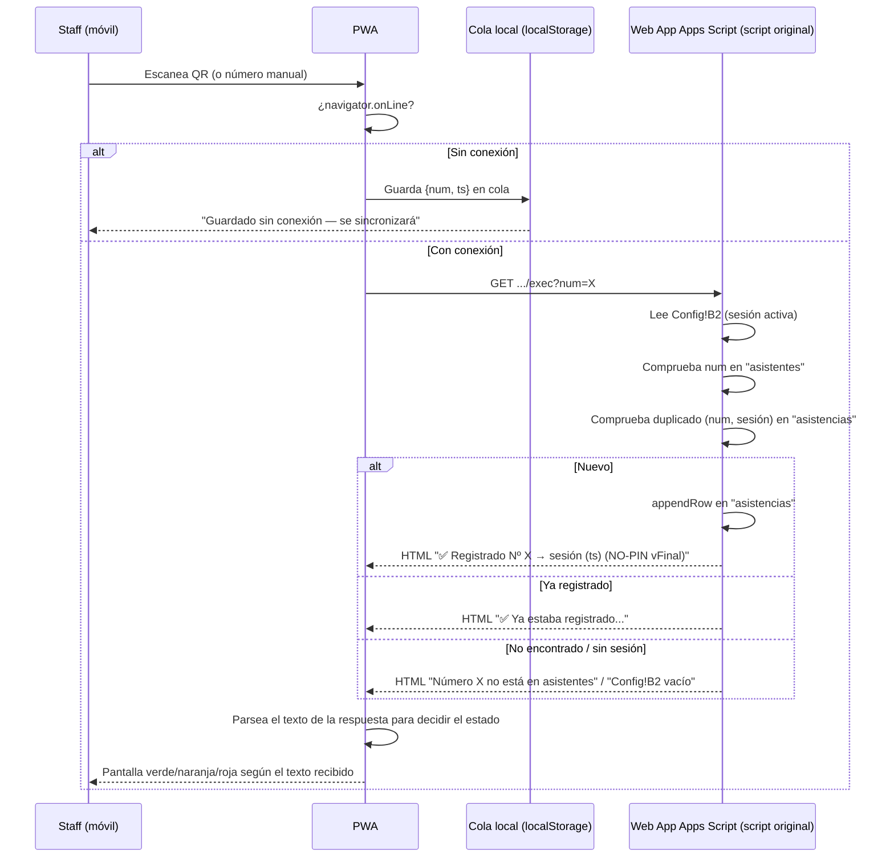
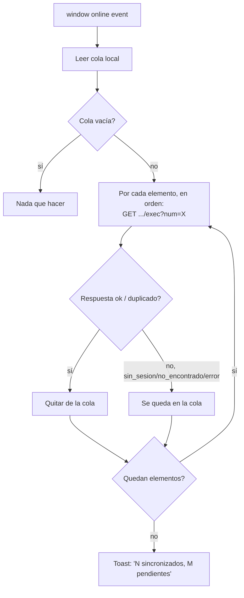
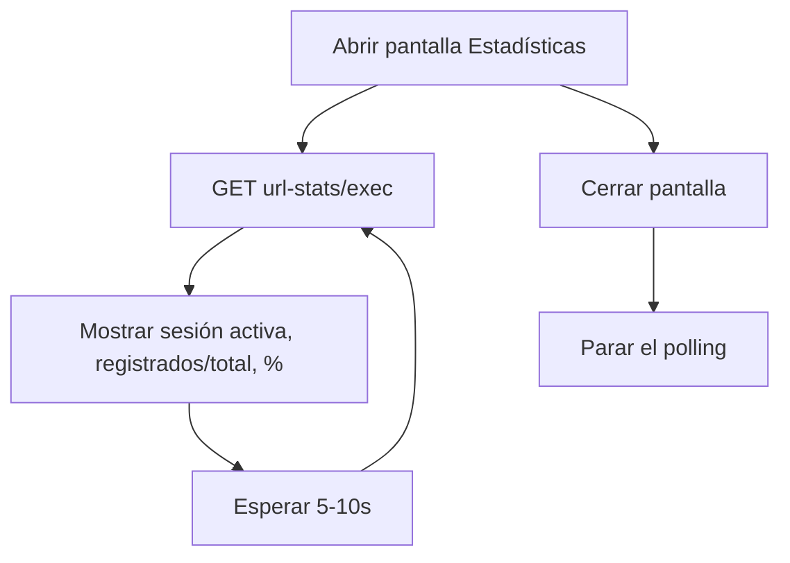
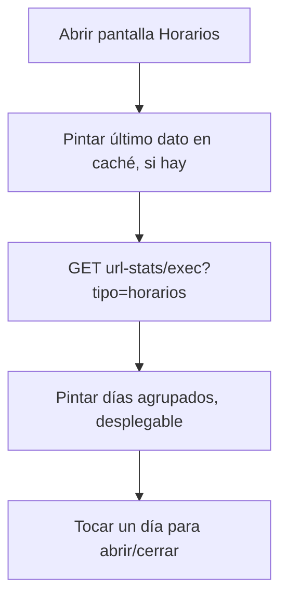
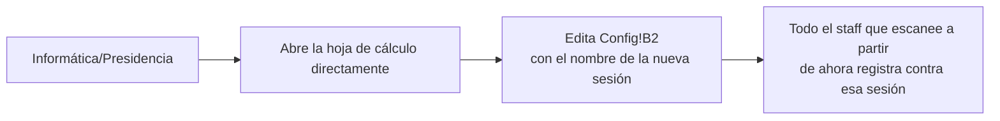

> ⚠️ Reescrito 2026-09-15 (D28): sin pantalla de Login — la app abre
> directamente en Escanear, no importa quién escanee. Sigue basado en
> Google Sheets + Apps Script, con el script real de Pau **tal cual**, sin
> extensiones (ni LockService, ni columna `staff`, ni acción `stats`, ni
> JSON — ver D21).

# Flujos — Staff AJapp (PWA)

Diagramas en Mermaid. Base: `apps-script/Code.gs` (script real
`NO-PIN vFinal`, sin extensiones) y `docs/SHEET_SCHEMA.md`.

## 1. Escanear / check-in (con offline)

```mermaid
sequenceDiagram
    participant U as Staff (móvil)
    participant App as PWA
    participant Q as Cola local (localStorage)
    participant WA as Web App Apps Script (script original)

    U->>App: Escanea QR (o número manual)
    App->>App: ¿navigator.onLine?
    alt Sin conexión
        App->>Q: Guarda {num, ts} en cola
        Q-->>U: "Guardado sin conexión — se sincronizará"
    else Con conexión
        App->>WA: GET .../exec?num=X
        WA->>WA: Lee Config!B2 (sesión activa)
        WA->>WA: Comprueba num en "asistentes"
        WA->>WA: Comprueba duplicado (num, sesión) en "asistencias"
        alt Nuevo
            WA->>WA: appendRow en "asistencias"
            WA-->>App: HTML "✅ Registrado Nº X → sesión (ts) (NO-PIN vFinal)"
        else Ya registrado
            WA-->>App: HTML "✅ Ya estaba registrado..."
        else No encontrado / sin sesión
            WA-->>App: HTML "Número X no está en asistentes" / "Config!B2 vacío"
        end
        App->>App: Parsea el texto de la respuesta para decidir el estado
        App-->>U: Pantalla verde/naranja/roja según el texto recibido
    end
```

**Sincronización al volver la conexión:**

```mermaid
flowchart TD
    A[window online event] --> B[Leer cola local]
    B --> C{Cola vacía?}
    C -- sí --> Z[Nada que hacer]
    C -- no --> D[Por cada elemento, en orden:<br/>GET .../exec?num=X]
    D --> E{Respuesta ok / duplicado?}
    E -- sí --> F[Quitar de la cola]
    E -- no, sin_sesion/no_encontrado/error --> G[Se queda en la cola]
    F --> H{Quedan elementos?}
    G --> H
    H -- sí --> D
    H -- no --> I[Toast: 'N sincronizados, M pendientes']
```

**Duplicados entre dos móviles distintos sin red:** si ambos escanean al
mismo asistente offline, los dos lo aceptan localmente (no pueden verse
entre sí). Al sincronizar, el primero que llegue al Web App se registra;
el segundo recibe la respuesta "Ya estaba registrado" — el script
original no usa `LockService` (D21), así que en el caso límite de que dos
sincronizaciones lleguen exactamente a la vez existe una ventana de
carrera teórica. No se ha resuelto porque Pau pidió no tocar el script;
queda anotado por si en algún momento se decide lo contrario.

## 2. Estadísticas (polling contra un Web App aparte, D22)

```mermaid
flowchart TD
    A[Abrir pantalla Estadísticas] --> B[GET url-stats/exec]
    B --> C[Mostrar sesión activa, registrados/total, %]
    C --> D[Esperar 5-10s]
    D --> B
    A --> E[Cerrar pantalla]
    E --> F[Parar el polling]
```

`url-stats` es la URL del Web App **separado** de solo lectura
(`apps-script/stats-readonly/`), distinta de la de check-in. No lleva
parámetros — siempre devuelve el estado de la sesión activa actual.

## 3. Horarios (mismo Web App que Estadísticas, con parámetro — D31)

```mermaid
flowchart TD
    A[Abrir pantalla Horarios] --> B[Pintar último dato en caché, si hay]
    B --> C[GET url-stats/exec?tipo=horarios]
    C --> D[Pintar días agrupados, desplegable]
    D --> E[Tocar un día para abrir/cerrar]
```

Sin polling — a diferencia de Estadísticas, los horarios no cambian
mientras alguien tiene la app abierta, así que se piden solo una vez al
entrar en la pantalla. Se edita cambiando celdas en la pestaña
`Horarios` de la hoja (ver `docs/SHEET_SCHEMA.md`), igual que la sesión
activa se edita en `Config!B2` (flujo 4, abajo).

## 4. Activar/cerrar sesión (fuera de la app — D15)

```mermaid
flowchart LR
    A[Informática/Presidencia] --> B[Abre la hoja de cálculo directamente]
    B --> C[Edita Config!B2<br/>con el nombre de la nueva sesión]
    C --> D[Todo el staff que escanee a partir<br/>de ahora registra contra esa sesión]
```

No hay ninguna pantalla ni login especial para esto en la app — es
exactamente como funcionaba con el Atajo de iPhone, solo que ahora varias
personas leen el mismo `Config!B2` en vez de una sola.

## 5. Inscripción / roster — fuera de alcance de este repo

La construcción de la lista `asistentes` (números + nombres) y cualquier
proceso de inscripción/registro con datos completos (DNI, menú, email...)
es un proceso aparte que Pau ya gestiona con el Excel/scripts de años
anteriores — **no es parte de lo que construye Claude Code en este repo**.
Si en el futuro se decide automatizar esa parte también, se documenta
aquí como una fase nueva.
